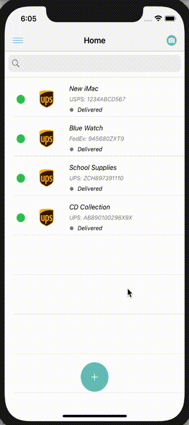

# Track It! - Package Tracker

This is the functional front-end for a small portion of a Package Tracker app - the Home Page module. The add tracking page is also included as it allows users to add tracking numbers to the Home Page. 

Time spent: **3** hours spent in total

## User Stories

The following functionality is completed:

- [x] User can view a list of all their packages
- [x] User tap a button to move to a new view to add a package
- [x] User can add a new package
- [x] User can search for packages by description

## Video Walkthrough

Here's a walkthrough of implemented user stories:

 

## License

    Copyright 2022 Asad Rizvi

    Licensed under the Apache License, Version 2.0 (the "License");
    you may not use this file except in compliance with the License.
    You may obtain a copy of the License at

        http://www.apache.org/licenses/LICENSE-2.0

    Unless required by applicable law or agreed to in writing, software
    distributed under the License is distributed on an "AS IS" BASIS,
    WITHOUT WARRANTIES OR CONDITIONS OF ANY KIND, either express or implied.
    See the License for the specific language governing permissions and
    limitations under the License.
